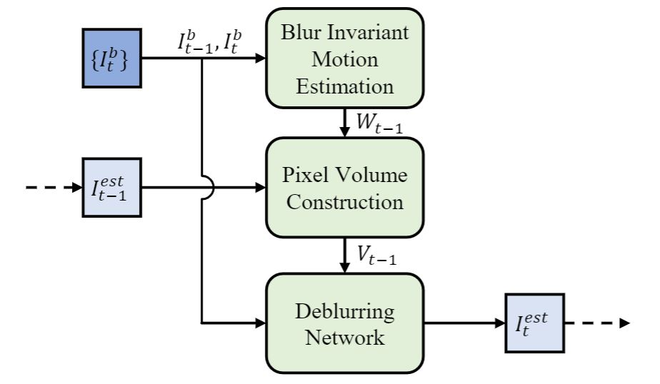
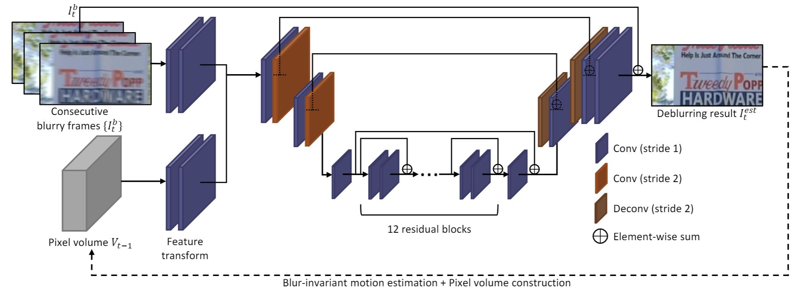
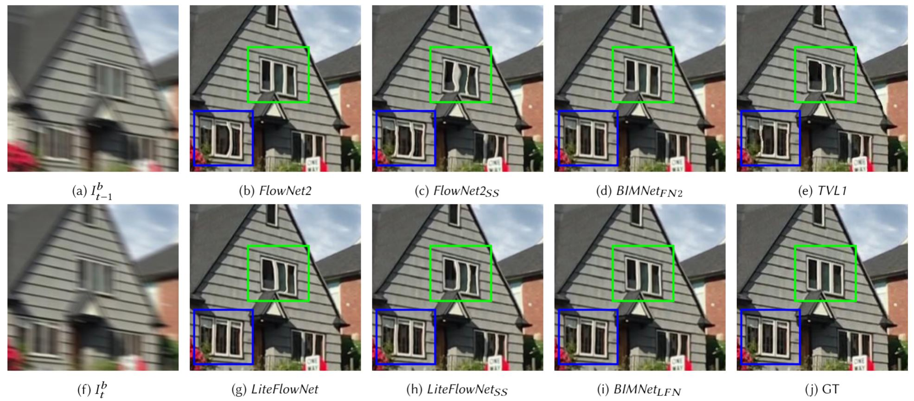
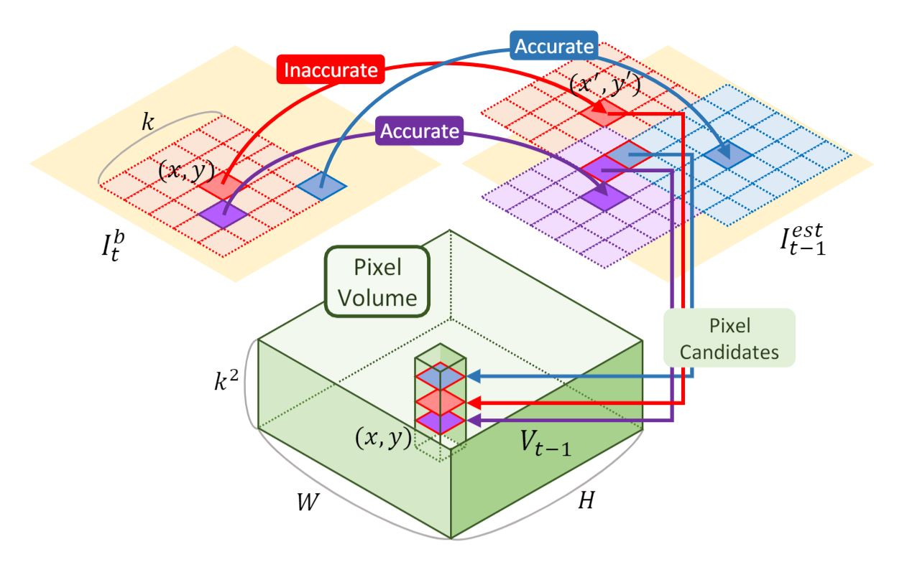

## PVDNet: Recurrent Video Deblurring with Blur-Invariant Motion Estimation and Pixel Volumes<br><sub>Official PyTorch Implementation of the TOG 2021 Paper</sub><br><sub>[Paper](https://dl.acm.org/doi/pdf/10.1145/3453720) | [arXiv](https://arxiv.org/abs/2108.09982) | [Supp](https://www.dropbox.com/s/eoqfpw3cex4z652/supp.zip?dl=1)</sub>

This repo contains training and evaluation code for the following paper:
> [**Recurrent Video Deblurring with Blur-Invariant Motion Estimation and Pixel Volumes**](https://dl.acm.org/doi/pdf/10.1145/3453720)<br>
> [Hyeongseok Son](https://sites.google.com/site/sonhspostech/), [Junyong Lee](https://junyonglee.me), Jonghyeop Lee, [Sunghyun Cho](https://www.scho.pe.kr/), and [Seungyong Lee](http://cg.postech.ac.kr/leesy/)<br>
> POSTECH<br>
> *ACM Transactions on Graphics (**TOG**) 2021 (presented at **SIGGRAPH** 2021)*<br>

<p align="left">
  <a href="https://youtu.be/2NDAEGAff50">
    
  </a>
</p>


## About the Research
<details>
    <summary><i>Click here</i></summary>
    <h3> Overall Framework </h3>
    <p align="center">
    
    </p>
    <p align="center">
    
    </p>
    <p>
        Our video deblurring framework consists of three modules: a blur-invariant motion estimation network (<i>BIMNet</i>), a pixel volume generator, and a pixel volume-based deblurring network (<i>PVDNet</i>).
        We first train <i>BIMNet</i>; after it has converged, we combine the two networks with the pixel volume generator.
        We then fix the parameters of <i>BIMNet</i> and train <i>PVDNet</i> by training the entire network.
    </p>
    <h3> Blur-Invariant Motion Estimation Network (<i>BIMNet</i>)</h3>
    <p>
        To estimate motion between frames accurately, we adopt <a "https://arxiv.org/pdf/1805.07036.pdf">LiteFlowNet</a> and train it with a blur-invariant loss so that the trained network can estimate blur-invariant optical flow between frames.
        We train <i>BIMNet</i> with a blur-invariant loss , which is defined as (refer Eq. 1 in the main paper):
    <p>
    <p align="center">
        
    </p>
    <p align="center">
        
    </p>
    <p>
        The figure shows a qualitative comparison of different optical flow methods.
        The results of the other methods contain severely distorted structures due to errors in their optical flow maps.
        In contrast, the results of BIMNets show much less distortions.
    </p>
    <h3> Pixel Volume for Motion Compensation </h3>
    <p>
        We propose a novel pixel volume that provides multiple candidates for matching pixels between images.
        Moreover, a pixel volume provides an additional cue for motion compensation based on the majority.
    </p>
    <p align="center">
        
    </p>
    <p>
        Our pixel volume approach leads to the performance improvement of video deblurring by utilizing the multiple candidates in a pixel volume in two aspects: 1) in most cases, the majority cue for the correct match would help as the statistics (Sec. 4.4 in the main paper) shows, and 2) in other cases, <i>PVDNet</i> would exploit multiple candidates to estimate the correct match referring to nearby pixels with majority cues.
    </P>
</details>


## Getting Started
### Prerequisites
*Tested environment*


#### 1. Environment setup
```bash
$ git clone https://github.com/codeslake/PVDNet.git
$ cd PVDNet

$ conda create -y --name PVDNet python=3.8 && conda activate PVDNet

# Install Pytorch (1.8.1 for example,)
$ conda install pytorch==1.8.0 torchvision==0.9.0 torchaudio==0.8.0 -c pytorch

# Install required dependencies (one of below depend on CUDA version)
# for CUDA10.2
$ sh install_CUDA10.2.sh
# for CUDA11.1
$ sh install_CUDA11.1.sh
# for CUDA11.3
$ sh install_CUDA11.3.sh
```

#### 2. Datasets
Download and unzip datasets under `[DATASET_ROOT]`:
* Su *et al.*'s dataset: [Google Drive](https://drive.google.com/open?id=1OY3mHiDbhCfVmwPA_gqckRDp4Ekryh7d&authuser=codeslake%40gmail.com&usp=drive_fs) \| [Dropbox](https://www.dropbox.com/s/8daduee9igqx5cw/DVD.zip?dl=1) 
* Nah *et al.*'s dataset: [Google Drive](https://drive.google.com/open?id=1O_VHISCRlff0gmfIqBnAr0RupvVUrJ9j&authuser=codeslake%40gmail.com&usp=drive_fs) \| [Dropbox](https://www.dropbox.com/s/5ese6qtbwy7fsoh/nah.zip?dl=1)

```
[DATASET_ROOT]
    ├── train_DVD
    ├── test_DVD
    ├── train_nah
    └── test_nah
```

> `[DATASET_ROOT]` can be modified with [`config.data_offset`](https://github.com/codeslake/PVDNet/blob/main/configs/config.py#L42-43) in `./configs/config.py`.

#### 3. Pre-trained models
Download and unzip pretrained weights ([Google Drive](https://www.dropbox.com/sh/frpegu68s0yx8n9/AACrptFFhxejSyKJBvLdk9IJa?dl=0) \| [Dropbox](https://www.dropbox.com/sh/frpegu68s0yx8n9/AACrptFFhxejSyKJBvLdk9IJa?dl=1)) under `./ckpt/`:

```
.
├── ...
├── ./ckpt
│   ├── BIMNet.pytorch
│   ├── PVDNet_DVD.pytorch
│   ├── PVDNet_nah.pytorch
│   └── PVDNet_large_nah.pytorch
└── ...
```

## Testing models of TOG 2021
*For PSNRs and SSIMs reported in the paper, we use the approach of [Koehler *et al.*](https://webdav.tuebingen.mpg.de/pixel/benchmark4camerashake/src_files/Pdf/Koehler_ECCV2012_Benchmark.pdf)
following [Su *et al.*](https://openaccess.thecvf.com/content_cvpr_2017/papers/Su_Deep_Video_Deblurring_CVPR_2017_paper.pdf),
that first aligns two images using global translation to represent the ambiguity in the pixel location caused by blur.*<br>
***Refer [here](https://github.com/codeslake/PVDNet/tree/main/evaluation) for the evaluation code.***

```shell
## Table 4 in the main paper (Evaluation on Su etal's dataset)
# Our final model 
CUDA_VISIBLE_DEVICES=0 python run.py --mode PVDNet_DVD --config config_PVDNet --data DVD --ckpt_abs_name ckpt/PVDNet_DVD.pytorch

## Table 5 in the main paper (Evaluation on Nah etal's dataset)
# Our final model 
CUDA_VISIBLE_DEVICES=0 python run.py --mode PVDNet_nah --config config_PVDNet --data nah --ckpt_abs_name ckpt/PVDNet_nah.pytorch

# Larger model
CUDA_VISIBLE_DEVICES=0 python run.py --mode PVDNet_large_nah --config config_PVDNet_large --data nah --ckpt_abs_name ckpt/PVDNet_large_nah.pytorch
```

> Testing results will be saved in `[LOG_ROOT]/PVDNet_TOG2021/[mode]/result/quanti_quali/[mode]_[epoch]/[data]/`.

> `[LOG_ROOT]` can be modified with [`config.log_offset`](https://github.com/codeslake/PVDNet/blob/main/configs/config.py#L56) in `./configs/config.py`.


#### options
* `--data`: The name of a dataset to evaluate: `DVD` | `nah` | `random`. Default: `DVD`
    * The data structure can be modified in the function [`set_eval_path(..)`](https://github.com/codeslake/PVDNet/blob/main/configs/config.py#L120-133) in `./configs/config.py`.
    * `random` is for testing models with any video frames, which should be placed as `[DATASET_ROOT]/random/[video_name]/*.[jpg|png]`. 

## Wiki
* [Logging](https://github.com/codeslake/PVDNet/wiki/Log-Details)
* [Training and testing details](https://github.com/codeslake/PVDNet/wiki/Training-&-Testing-Details)

## Contact
Open an issue for any inquiries.
You may also have contact with [sonhs@postech.ac.kr](mailto:sonhs@postech.ac.kr) or [junyonglee@postech.ac.kr](mailto:junyonglee@postech.ac.kr)

## License
<br>
This software is being made available under the terms in the [LICENSE](LICENSE) file.
Any exemptions to these terms require a license from the Pohang University of Science and Technology.

## Citation
If you find this code useful, please consider citing:
```
@Article{Son2021PVDNet,
    author  = {Hyeongseok Son and Junyong Lee and Jonghyeop Lee and Sunghyun Cho and Seungyong Lee},
    title   = {Recurrent Video Deblurring with Blur-Invariant Motion Estimation and Pixel Volumes},
    journal = {ACM Transactions on Graphics (TOG)},
    volume  = {40},
    number  = {5},
    year    = {2021}
}
```

