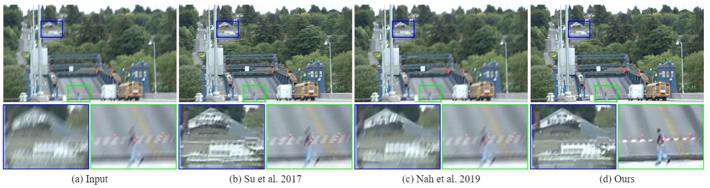

# Recurrent Video Deblurring with Blur-Invariant Motion Estimation and Pixel Volumes




This repository contains the official PyTorch implementation of the following paper:

> **[Recurrent Video Deblurring with Blur-Invariant Motion Estimation and Pixel Volumes (TODO)](http://cg.postech.ac.kr/papers/2020_CGI_JY.pdf)**<br>
> Hyeongseok Son, Junyong Lee, Jonghyeop Lee, Sunghyun Cho, Seungyong Lee, TOG2021

If you find this code useful, please consider citing:
```
@InProceedings{Son_2021_TOG,
author = {Son, Hyeongseok and Lee, Junyong and Lee, Jonghyeop and Cho, Sunghyun and Lee, Seungyong},
title = {Recurrent Video Deblurring with Blur-Invariant Motion Estimation and Pixel Volumes},
booktitle = {Trans. Graphics},
month = {June},
year = {2021}
}
```

For any inquiries, please contact [sonhs@postech.ac.kr](mailto:sonhs@postech.ac.kr) or [junyonglee@postech.ac.kr](mailto:junyonglee@postech.ac.kr)

## Resources

All material related to our paper is available by following links:

| Link |
| :-------------- |
| [The main paper (todo)](https://drive.google.com/file/d/1mRVo3JefkgRd2VdJvG5M-8xWtvl60ZWg/view?usp=sharing) |
| [Supplementary Files (todo)](https://drive.google.com/file/d/1sQTGHEcko2HxoIvneyrot3bUabPrN5l1/view?usp=sharing) |
| [Checkpoint Files (todo)](https://www.dropbox.com/s/qohhmr9p81u0syi/checkpoints.zip?dl=0) |
| Su *etal*'s dataset ([download](https://www.dropbox.com/s/8daduee9igqx5cw/DVD.zip?dl=0)/[reference](http://www.cs.ubc.ca/labs/imager/tr/2017/DeepVideoDeblurring/#dataset)) |
| Nah *etal*'s dataset ([download](https://www.dropbox.com/s/5ese6qtbwy7fsoh/nah.zip?dl=0)/[reference](https://seungjunnah.github.io/Datasets/gopro)) |

## Training & testing of the network
*Requirements*: `pip install -r requirements.txt`
### Training
> Download and unzip [Su *etal*'s dataset](https://www.dropbox.com/s/8daduee9igqx5cw/DVD.zip?dl=0) or [Nah *etal* dataset](https://www.dropbox.com/s/5ese6qtbwy7fsoh/nah.zip?dl=0) under `./datasets` (the offset can be modified by `config.data_offset` in `./configs/config.py`).
> Folder structure for Su *etal*'s dataset: `./datasets/train_DVD`. For Nah *etal* dataset:  `./datasets/train_nah`.

```bash
# multi GPU (with DistributedDataParallel) example
CUDA_VISIBLE_DEVICES=0,1,2,3 python -B -m torch.distributed.launch --nproc_per_node=4 --master_port=9000 run.py \
--is_train \
--mode PVDNet_DVD \
--config config_PVDNet \
--trainer trainer \
--data DVD \
-LRS CA \
-b 2 \
-th 8 \
-dl \
-dist

# single GPU (with DataParallel) example
CUDA_VISIBLE_DEVICES=0 python -B run.py \
--is_train \
--mode PVDNet_DVD \
--config config_PVDNet \
--trainer trainer \
--data DVD \
-LRS CA \
-b 8 \
-th 8 \
-dl
```
* options
    * `--is_train`: If it is specified, `run.py` will train the network.  
    * `--mode`: The name of training mode. The logging folder named with the `mode` will be created under `./logs/PVDNet_TOG2021/[mode]`. 
    * `--config`: The name of config file located as in `./config/[config].py` (config_PVDNet.py is used for our final model. config_joint.py is for jointly training BIMNet and PVDNet).
    * `--trainer`: The name of trainer file located as in `./models/trainers/[trainer].py`.
    * `--data`: The name of dataset (`DVD` or `nah`).
    * `--LRS`: Learning rate scheduler to use (`CA`:Cosine annealing scheduler or `LD`:for step decay scheduler).
    * `--network`: The name of network file (of PVDNet) located as in `./models/archs/[network].py`.
    * `-b`: The batch size. For the multi GPU (`DistributedDataParallel`), the total batch size will be, `nproc_per_node * b`.
    * `-th`: The number of thread (`num_workers`) used for the data loader (defined in `./models/baseModel`).
    * `-dl`: The option whether to delete logs under `mode` (i.e., `./logs/PVDNet_TOG2021/[mode]/*`). Option works only when `--is_train` is specified.
    * `-r`: Resume training with specified epoch # (e.g., `-r 100`). Note that `-dl` should not be specified with this option.
    * `-dist`: whether to use `DistributedDataParallel`.
    * `-ss`: whether to save sample images (samples can be found in `./logs/PVDNet_TOG2021/samples`).

### Testing
```bash
python run.py --mode [MODE] --data [DATASET]
# e.g., python run.py --mode PVDNet_DVD --data DVD
```
* options
    * `--mode`: The name of the training mode that you want to test.
    * `--data`: The name of a dataset for evaluation. We have `DVD, nah and any`, and their path can be modified by the function `set_eval_path(..)` in `./configs/config.py`.
    * `-ckpt_name`: Load the checkpoint with the name of the checkpoint under `./logs/PVDNet_TOG2021/[mode]/checkpoint/train/epoch/ckpt/` (e.g., `python run.py --mode PVDNet_DVD --data DVD --ckpt_name PVDNet_DVD_00000.pytorch`).
    * `-ckpt_abs_name`. Loads the checkpoint of the absolute path (e.g., `python run.py --mode PVDNet_DVD --data DVD --ckpt_abs_name ./ckpt/PVDNet_DVD.pytorch`).
    * `-ckpt_epoch`: Loads the checkpoint of the specified epoch (e.g., `python run.py --mode PVDNet_DVD --data DVD --ckpt_epoch 0`). 
    * `-ckpt_sc`: Loads the checkpoint with the best validation score (e.g., `python run.py --mode PVDNet_DVD --data DVD --ckpt_sc`)    

## Testing with pre-trained weights of TOG2021
> Download pretrained weights from [here TODO](). Then, unzip them under `./ckpt`.
> Download and unzip [Su *etal*'s dataset](https://www.dropbox.com/s/8daduee9igqx5cw/DVD.zip?dl=0) or [Nah *etal*'s dataset](https://www.dropbox.com/s/5ese6qtbwy7fsoh/nah.zip?dl=0) under `./datasets` (the offset can be modified by `config.data_offset` in `./configs/config.py`).
> Folder structure for Su *etal*'s dataset: `./datasets/test_DVD`. For Nah *etal* dataset: `./datasets/test_nah`.

To test the final model:
    ```bash
    ## Table 4 in the main paper (Evaluation on Su <i>etal</i>'s dataset)
    # Our final model 
    python run.py --mode PVDNet_DVD --config config_PVDNet --data DVD --ckpt_abs_name ckpt/PVDNet_DVD.pytorch

    ## Table 5 in the main paper (Evaluation on Nah <i>etal</i>'s dataset)
    # Small model on Nah <i>etal</i>'s dataset
    python run.py --mode PVDNet_nah --config config_PVDNet --data nah --ckpt_abs_name ckpt/PVDNet_nah.pytorch
    # Large model
    python run.py --mode PVDNet_nah --config config_PVDNet_large --data nah --ckpt_abs_name ckpt/PVDNet_large_nah.pytorch
    ```

    * `--data`: The name of a dataset for evaluation. We have `DVD, nah` and `any`, where their path can be modified by the function `set_eval_path(..)` in `./configs/config.py`. `--data any` is for testing models with any images, which should be placed under the folder `./datasets/any`. 


## License ##
This software is being made available under the terms in the [LICENSE](LICENSE) file.

Any exemptions to these terms require a license from the Pohang University of Science and Technology.

## About Coupe Project ##
Project ‘COUPE’ aims to develop software that evaluates and improves the quality of images and videos based on big visual data. To achieve the goal, we extract sharpness, color, composition features from images and develop technologies for restoring and improving by using them. In addition, personalization technology through user reference analysis is under study.  
    
Please checkout other Coupe repositories in our [Posgraph](https://github.com/posgraph) github organization.

## Useful Links ##
* [Coupe Library](http://coupe.postech.ac.kr/)
* [POSTECH CG Lab.](http://cg.postech.ac.kr/)
